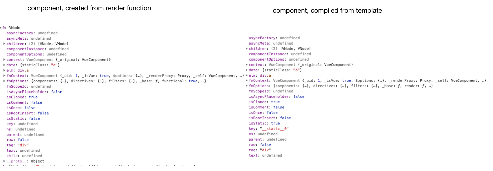

# vue-functional-bug

This demo shows two different functional components `FunTemplate1`
```
<template functional>
  <div class="a">
    <div class="b">first (template)</div>
    <div class="b">component</div>
  </div>
</template>
```
and `FunTemplate2`, created by vue-compiler by has the same `key` `__static__0`, so Vue warns about that. 

If you create the same components from render function directly, it works fine, without duplicated keys (keys are `undefined` in this situation)
```
<script>
export default {
  functional: true,
  render(createElement) {
    return createElement("div", {
        staticClass: "a"
    }, [createElement("div", {
        staticClass: "b"
    }, ["first"]), createElement("div", {
        staticClass: "b"
    }, ["component"])])
  }
}
</script>
```

This image the difference in VNode objects.


Moreover, if FunTemplate1 looks likes this
```
<template functional>
  <div class="a">first (template) component</div>
</template>
```
it works fine too.

Vue Template Exporer will go crazy too if you try to compile `FunTemplate1`
https://template-explorer.vuejs.org/#%3Cdiv%20class%3D%22a%22%3E%0A%20%20%3Cdiv%20class%3D%22b%22%3Efirst%20(template)%3C%2Fdiv%3E%0A%20%20%3Cdiv%20class%3D%22b%22%3Ecomponent%3C%2Fdiv%3E%0A%3C%2Fdiv%3E%0A


## Project setup
```
npm install
```

### Compiles and hot-reloads for development
```
npm run serve
```

### Compiles and minifies for production
```
npm run build
```

### Lints and fixes files
```
npm run lint
```
